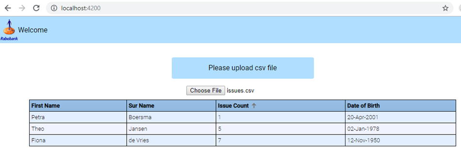

# Assignment Details

This angular app is capable of importing csv file from local machine and visualize it on the screen. Angular-material component is added for column filtering. 

# Version

Development IDE: IntelliJ IDEA 2019.1.3 (Ultimate Edition)  
Angular CLI: 8.3.4  
Node: 10.16.0  
OS: win32 x64  
Angular: 8.2.6  

@angular-devkit/architect         0.803.4  
@angular-devkit/build-angular     0.803.4  
@angular-devkit/build-optimizer   0.803.4  
@angular-devkit/build-webpack     0.803.4  
@angular-devkit/core              8.3.4  
@angular-devkit/schematics        8.3.4  
@angular/cdk                      8.2.0  
@angular/cli                      8.3.4  
@angular/material                 8.2.0  
@ngtools/webpack                  8.3.4  
@schematics/angular               8.3.4  
@schematics/update                0.803.4  
rxjs                              6.4.0  
typescript                        3.5.3  
webpack                           4.39.2  

## Development server

Run `ng serve` for a dev server. Navigate to `http://localhost:4200/`. The app will automatically reload if you change any of the source files.

## Build and deployment

Run `ng build` to build the project. The build artifacts will be stored in the `dist/` directory. Use the `--prod` flag for a production build.
Dist folder contains production build. 
For deployment, just need to have our server using Apache or nginx serve all requests to this index.html file. Angular will take care of the rest.

## Running unit tests

Run `ng test` to execute the unit tests via [Karma](https://karma-runner.github.io).
